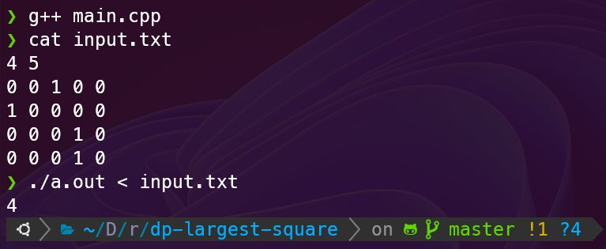

# dp-largest-square

動的計画法で面積最大の正方形の面積を求める問題

## Demo



## Problem

問題文は次のリンクを参照してください。

- <https://judge.u-aizu.ac.jp/onlinejudge/description.jsp?id=DPL_3_A&lang=jp>

## Usage

コンパイルと実行方法

```bash
$ g++ main.cpp

$ ./a.out < input.txt
> 4

$ ./a.out < input2.txt
> 9

$ ./a.out < input3.txt
> 1

```

## Author

- 作成者 : Takahashi Katsuyuki
- E-mail : [Takahashi.Katsuyuki.github@gmail.com](Takahashi.Katsuyuki.github@gmail.com)

## License

"dp-largest-square" is under [MIT license](https://en.wikipedia.org/wiki/MIT_License).
